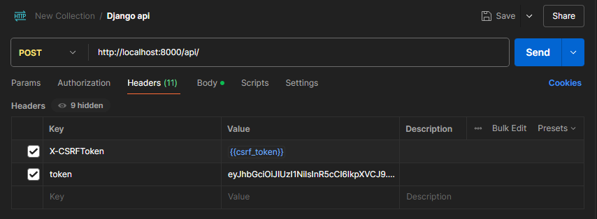
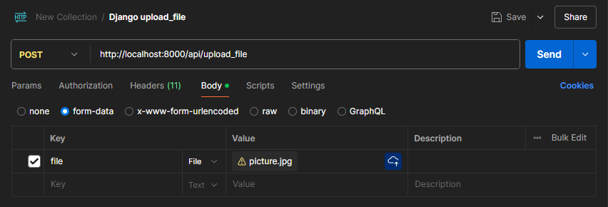
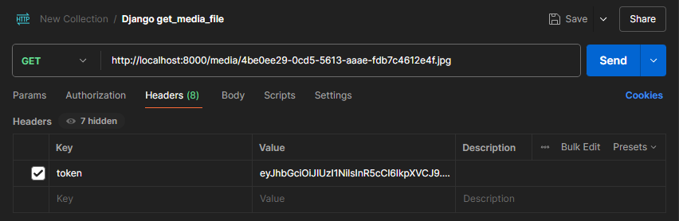

# Backend


## Database

For communication between the front end and back end, most of the data should be a JSON object.

Here are some examples of database objects.

### User

```json
{
    // int auto
    "uid": 0,
    // str varchar(50)
    "l_name": "al",
    // str, varchar(50)
    "f_name": "af",
    // str varchar(255)
    "email": "3@e.com",
    // float date
    // all date/datetime should be converted into float to transmission between the front end and back end
    // in seconds, not milliseconds
    "dob": 1728805599.043506,
    // str varchar(255)
    // stores hased password using md5 method
    "password": "str",
    // bool bool
    // indicate a user wheather an admin
    "admin": false,
    // float datetime
    // last wrong login attempt, user lockout until this time + 30 minutes
    "lockout": 1728805599.043506, 
    // str varchar(15)
    "description": "str?"
}

```

> [!note]
>
> all date/datetime should be converted into a float timestamp to transmission between the front end and back end


### Trainer

```json
{
    // int auto
    "tid": 0,
    // int foreign key
    "provid": 0,
    // str varchar(50)
    "l_name": "al",
    // str varchar(50)
    "f_name": "af",
    // str varchar(255)
    "email": "3@e.com",
    // float date
    "dob": 1728805599.043506,
    // str varchar(255)
    "password": "str",
    // float datetime
    "lockout": 1728805599.043506
}
```


### Provider

```json
{
    // int auto
    "provid": 0,
    // str varchar(50)
    "provider_name": "str",
    // str varchar(255)
    "email": "str",
    // str varchar(255)
    "password": "str",
    // str varchar(50)
    "phone_number": "str",
    // float datetime
    "lockout": 1728805599.043506
}
```


### User_Avatar

```json
{
    // int foreign key
    "uid": 0,
    // str varchar(260)
    // the URL of the image
    "avatar": "str"
}
```


### Trainer_Avatar

```json
{
    // int foreign key
    "tid": 0,
    // str varchar(260)
    // the URL of the image
    "avatar": "str"
}
```


### Pet_Avatar

```json
{
    // int foreign key
    "pid": 0,
    // str varchar(260)
    // the URL of the image
    "avatar": "str"
}
```


### Pet

```json
{
    // int auto
    "pid": 0,
    // int foreign key
    "uid": 0,
    // str varchar(25)
    "p_name": "str",
    // str varchar(25)
    "species": "str",
    // str varchar(25)
    "breed": "str",
    // int
    "age": 0,
    // str varchar(500)
    "diagnosis": "str",
    // float date
    "dob": 1728805599.043506
}
```


### Service_Order

```json
{
    // int auto
    "order_id": 0,
    // int foreign key
    "pid": 0,
    // int foreign key
    "uid": 0,
    // int foreign key
    "tid": 0,
    // float datetime
    "order_date": 1728805599.043506,
    // str varchar(15)
    "service_type": "str",
    // int
    "cost": 0,
    // status
    "status": "str"
}
```


### Payment

```json
{
    // int auto
    "paymentid": 0,
    // int foreign key
    "order_id": 0,
    // str varchar(25)
    "payment_info": "str"
}
```


## API

### get_csrf_token

```
GET /api/get_csrf_token
```

#### result

```json
{
    "error_code": 200,
    "data": {
        "csrf_token": "cM501K9SvtcPGu5zByd873V8PJwE2u8FjQ9Jjs1kRTeecotMjPh7cxtRSOIqvOCa"
    },
    "error_msg": null
}
```

> [!note]
>
> You must get a CSRF token before you request backend by POST, PUT, or DELETE.


### POST API

> [!note]
>
> This API can do all things. Using different parameters in request.body to call functions.

```
POST /api
```

#### Examples

> [!note]
>
> Some functions need a valid token in request.headers.
>
> Your request.headers should have two fields: X-CSRFToken and token.



##### 1. user_login

> [!note]
>
> All parameters should be stored in request.body.

```json
{
	"function": "user_login", 
	"data": {
        "user": {
            "email": "str",
            "password": "str"
        }
    }
}
```

###### result

```json
{
    "error_code": 200,
    "data": {
        "token": "str"
    },
    "error_msg": "str?"
}
```


##### 2. provider_login

```json
{
	"function": "provider_login", 
	"data": {
        "provider": {
            "email": "str",
            "password": "str"
        }
    }
}
```

###### result

```json
{
    "error_code": 200,
    "data": {
        "token": "str"
    },
    "error_msg": "str?"
}
```


##### 3. trainer_login

```json
{
	"function": "provider_login", 
	"data": {
        "trainer": {
            "email": "str",
            "password": "str"
        }
    }
}
```

###### result

```json
{
    "error_code": 200,
    "data": {
        "token": "str"
    },
    "error_msg": "str?"
}
```


##### 4. user_register

> [!note]
>
> You can also POST /rest/user using the same parameters, but there is no function key.

```json
{
	"function": "user_register", 
	"data": {
        "user": {
            "l_name": "str",
            "f_name": "str",
            "email": "str",
            "dob": 1728805599.043506,
            "password": "str",
            "admin": false,
            "lockout": 1728805599.043506
            "description": "str?"
        }
    }
}
```

###### result

```json
{
    "error_code": 200,
    "data": null,
    "error_msg": "str?"
}
```


##### 5. provider_register

>[!note]
>
> You can also POST /rest/provider using the same parameters, but there is no function key.

```json
{
	"function": "provider_register", 
	"data": {
        "provider": {
            "provider_name": "str",
            "email": "str",
            "phone_number": "str",
            "password": "str",
            "lockout": 1728805599.043506
        }
    }
}
```

###### result

```json
{
    "error_code": 200,
    "data": null,
    "error_msg": "str?"
}
```


##### 6. provider_register

>[!note]
>
>You can also POST /rest/trainer using the same parameters, but there is no function key.

```json
{
	"function": "trainer_register", 
	"data": {
        "trainer": {
            // int
            "provid": 0,
            "l_name": "str",
            "f_name": "str",
            "email": "str",
            "dob": 1728805599.043506,
            "password": "str",
            "lockout": 1728805599.043506
        }
    }
}
```

###### result

```json
{
    "error_code": 200,
    "data": null,
    "error_msg": "str?"
}
```


##### 7. user_check_exists

```json
{
	"function": "user_check_exists", 
	"data": {
        "user": {
            "email": "str"
        }
    }
}
```

###### result

```json
{
    "error_code": 200,
    "data": true,
    "error_msg": "str?"
}
```


##### 8. provider_check_exists

```json
{
	"function": "provider_check_exists", 
	"data": {
        "provider": {
            "email": "str"
        }
    }
}
```

###### result

```json
{
    "error_code": 200,
    "data": true,
    "error_msg": "str?"
}
```


##### 9. trainer_check_exists

```json
{
	"function": "trainer_check_exists", 
	"data": {
        "trainer": {
            "email": "str"
        }
    }
}
```

###### result

```json
{
    "error_code": 200,
    "data": true,
    "error_msg": "str?"
}
```


##### 10. user_update

>[!note]
> You can also PUT /rest/user using the same parameters, but there is no function key.

```json
{
	"function": "user_update", 
	"data": {
        "user": {
            // user who want to update
            "email": "str",
        },
        "user_new": {
            // what you want to update
            "l_name": "str",
            "f_name": "str",
            "email": "str",
            "dob": 1728805599.043506,
            "password": "str",
            "admin": false,
            "description": "str?",
            "lockout": 1728805599.043506
        }
    }
}
```

###### result

```json
{
    "error_code": 200,
    "data": null,
    "error_msg": "str?"
}
```


##### 11. user_delete

>[!note]
>You can also DELETE /rest/user using the same parameters, but there is no function key.

```json
{
	"function": "user_delete", 
	"data": {
        "user": {
            "email": "str",
        }
    }
}
```

###### result

```json
{
    "error_code": 200,
    "data": null,
    "error_msg": "str?"
}
```


##### 12. user_select

>[!note]
>You can also GET /rest/user using the same parameters, but there is no function key.
>
>If you use rest API, the filters need to be put on the parameters rather than request.body.
>
>For example: GET /rest/user?uid=10

```json
{
	"function": "user_select", 
	"data": {
        // filter
        "user": {
            "uid": 0, 
            "l_name": "al",
            "f_name": "af",
            "email": "3@e.com",
            "dob": 1728805599.043506,
            "password": "str",
            "admin": false,
            "description": "str?",
            "lockout": 1728805599.043506
        }
    }
}
```

###### result

```json
{
    "error_code": 200,
    "data": {
        "user_list": [
            {
                "uid": 0,
                "l_name": "al",
                "f_name": "af",
                "email": "3@e.com",
                "dob": 1728805599.043506,
                // if not admin, not include this
                "password": "str",
                "admin": false,
                "lockout": 1728805599.043506
                "description": "str?"
            }
        ]
    },
    "error_msg": "str?"
}
```


##### 13. pet_update

>[!note]
>You can also PUT /rest/pet using the same parameters, but there is no function key.
>
>

```json
{
	"function": "pet_update", 
	"data": {
        "pet": {
            "pid": 0
        },
        "pet_new": {
            "p_name": "str",
            "species": "str",
            "breed": "str",
            "age": 0,
            "uid": 0,
            "diagnosis": "str",
            "dob": 1728805599.043506
        }
    }
}
```

###### result

```json
{
    "error_code": 200,
    "data": null,
    "error_msg": "str?"
}
```


##### 14. pet_delete

>[!note]
>You can also DELETE /rest/pet using the same parameters, but there is no function key.
>
>

```json
{
	"function": "pet_delete", 
	"data": {
        "pet": {
            "pid": 0
        }
    }
}
```

###### result

```json
{
    "error_code": 200,
    "data": null,
    "error_msg": "str?"
}
```


##### 15. pet_select

>[!note]
>You can also GET /rest/pet using the same parameters, but there is no function key.
>
>If you use rest API, the filters need to be put on the parameters rather than request.body.
>
>For example: GET /rest/pet?pid=10

```json
{
	"function": "pet_select", 
	"data": {
        // filter
        "pet": {
            "pid": 0
            "uid": 0,
            "p_name": "str",
            "species": "str",
            "breed": "str",
            "age": 0,
            "diagnosis": "str",
            "dob": 1728805599.043506
        }
    }
}
```

###### result

```json
{
    "error_code": 200,
    "data": {
        "pet_list": [
            {
                "pid": 0,
                "uid": 0,
                "p_name": "str",
                "species": "str",
                "breed": "str",
                "age": 0,
                // if not admin or owner, remove this
                "diagnosis": "str",
                "dob": 1728805599.043506
            }
        ]
    },
    "error_msg": "str?"
}
```


##### 16. pet_create

>[!note]
>You can also POST /rest/pet using the same parameters, but there is no function key.
>
>User authorisation is needed. The pet will be created using the uid of the user who is using the token.

```json
{
	"function": "pet_create", 
	"data": {
        "pet": {
            "p_name": "str",
            "species": "str",
            "breed": "str",
            "age": 0,
            "diagnosis": "str?",
            "dob": 1728805599.043506
        }
    }
}
```

###### result

```json
{
    "error_code": 200,
    "data": {
        "error_code": 200,
        "data": null,
        "error_msg": "str?"
    },
    "error_msg": "str?"
}
```


##### 17. user_avatar_update

>[!note]
>You can also PUT /rest/user_avatar using the same parameters, but there is no function key.
>
>

```json
{
	"function": "user_avatar_update", 
	"data": {
        "user_avatar": {
            "uid": 0,
        },
        "user_avatar_new": {
            "avatar": "str"
        }
    }
}
```

###### result

```json
{
    "error_code": 200,
    "data": null,
    "error_msg": "str?"
}
```


##### 18. user_avatar_delete

>[!note]
>You can also DELETE /rest/user_avatar using the same parameters, but there is no function key.
>
>

```json
{
	"function": "user_avatar_delete", 
	"data": {
        "pet": {
            "pid": 0
        }
    }
}
```

###### result

```json
{
    "error_code": 200,
    "data": null,
    "error_msg": "str?"
}
```


##### 19. user_avatar_select

>[!note]
>You can also GET /rest/user_avatar using the same parameters, but there is no function key.
>
>If you use rest API, the filters need to be put on the parameters rather than request.body.
>
>For example: GET /rest/user_avatar?uid=10

```json
{
	"function": "user_avatar_select", 
	"data": {
        "user_avatar": {
            "uid": 0,
            "avatar": "str"
        }
    }
}
```

###### result

```json
{
    "error_code": 200,
    "data": {
        "user_avatar_list": [
            {
                "uid": 0,
                "avatar": "str"
            }
        ]
    },
    "error_msg": "str?"
}
```


##### 20. user_avatar_create

>[!note]
>You can also POST /rest/user_avatar using the same parameters, but there is no function key.
>
>User authorisation is needed. The user_avatar will be created using the uid of the user who is using the token.

```json
{
	"function": "user_avatar_create", 
	"data": {
        "user_avatar": {
            "avatar": "str"
        }
    }
}
```

###### result

```json
{
    "error_code": 200,
    "data": {
        "error_code": 200,
        "data": null,
        "error_msg": "str?"
    },
    "error_msg": "str?"
}
```


> [!warning]
>
> Similar descriptions for 
>
> ```python
> case 'trainer_avatar_update':
> case 'trainer_avatar_delete':
> case 'trainer_avatar_create':
> case 'trainer_avatar_select':
> case 'pet_avatar_update':
> case 'pet_avatar_delete':
> case 'pet_avatar_create':
> case 'pet_avatar_select':
> case 'service_order_update':
> case 'service_order_delete':
> case 'service_order_create':
> case 'service_order_select':
> case 'payment_update':
> case 'payment_delete':
> case 'payment_create':
> case 'payment_select':
> case 'trainer_update':
> case 'trainer_delete':
> case 'trainer_select':
> case 'provider_update':
> case 'provider_delete':
> case 'provider_select':
> ```
>
> Will not give.
>
> You can refer to the related py file.
>
> For example, for trainer_avatar, the function descriptions in the /Backend/ELEC9609/API/Modules/Trainer_Avatar.py give examples of parameters and results.


## Upload File

Use POST /api/upload_file to upload a file to the backend. If that succeeds, you will get a relative URL to the uploaded file.



Use form-data with "file": "\<file\>" to submit the file.

### result

```json
{
    "error_code": 200,
    "data": {
        "url": "/media/7d1a485a-b8df-504f-a1cd-043c7bb52599.jpg"
    },
    "error_msg": "file uploaded: 7d1a485a-b8df-504f-a1cd-043c7bb52599.jpg"
}
```


## Get File



You also need a token to get the file.

The backend will return a FileResponse when you do that.
